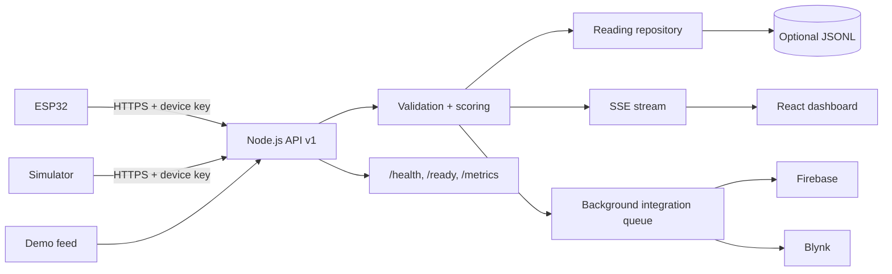

# Fieldline — IoT Crop Monitoring & Irrigation Decision Platform

Fieldline is an IoT telemetry platform for monitoring crop conditions from ESP32-based field sensors. It validates and stores sensor readings, computes interpretable crop-health and irrigation indicators, streams live updates to a React dashboard, and can mirror accepted telemetry to Firebase Realtime Database and Blynk.

## Features

### Telemetry and decision logic

- ESP32 and simulator ingestion for soil moisture, temperature, humidity, battery, GPS, device ID, and timestamp.
- Strict telemetry validation and normalization.
- Interpretable crop-health scoring with component-level scores.
- Rule-based irrigation recommendations and alert generation.
- Device inventory, current-state summaries, and filtered telemetry history.
- Optional append-only JSONL persistence for restart-safe local deployments.

### Real-time dashboard

- Server-Sent Events (SSE) for live browser updates.
- Automatic reconnect with HTTP fallback refresh.
- Responsive React dashboard with loading, empty, reconnecting, and error states.
- Device selection, historical sparklines, irrigation state, active alerts, component scores, and CSV export.
- Accessible controls, keyboard focus states, reduced-motion support, and mobile layouts.

### Reliability, security, and observability

- Optional `X-Device-Key` authentication for telemetry producers.
- Per-IP ingestion and read rate limiting.
- Request size limits and JSON-only write endpoints.
- Configurable CORS allowlist.
- Security headers and restrictive Content Security Policy in production.
- Structured JSON request logs with request IDs and request timing.
- `/health`, `/ready`, and Prometheus-compatible `/metrics` endpoints.
- Bounded background integration queue with retry and exponential backoff for Firebase/Blynk.
- Graceful SIGTERM/SIGINT shutdown.

### Engineering workflow

- Unit and integration tests with Node's built-in test runner.
- Multi-stage production Docker image.
- Docker Compose setup with persistent local volume and telemetry simulator.
- Render deployment blueprint.
- GitHub Actions CI for syntax checks, tests, frontend build, and Docker build.

## Architecture



Detailed design: [`docs/architecture.md`](docs/architecture.md)

## Tech stack

| Layer | Technology |
|---|---|
| Backend | Node.js 22, native HTTP server |
| Frontend | React 19, Vite 7 |
| Real-time | Server-Sent Events |
| Edge / IoT | ESP32, DHT22, capacitive soil sensor, TinyGPSPlus |
| Persistence | Bounded in-memory repository + optional JSONL |
| Integrations | Firebase Realtime Database, Blynk IoT |
| Containerization | Docker, Docker Compose |
| CI | GitHub Actions |
| Deployment | Render Docker web service |

## Repository structure

```text
.
├── backend/
│   ├── app.mjs
│   ├── config.mjs
│   ├── server.mjs
│   ├── lib/
│   └── test/
├── frontend/
│   └── src/
│       ├── components/
│       ├── hooks/
│       ├── api.js
│       └── App.jsx
├── firmware/
├── simulator/
├── docs/
│   ├── api.md
│   └── architecture.md
├── .github/workflows/ci.yml
├── Dockerfile
├── docker-compose.yml
├── render.yaml
└── .env.example
```

## Local setup

### Requirements

- Node.js 22+
- npm 10+

### Install dependencies

```bash
npm install
```

### Configure environment

PowerShell:

```powershell
Copy-Item .env.example .env
```

For local development, `DEVICE_API_KEY` can remain empty. For a public deployment, set secrets through the hosting platform rather than committing them.

### Start the API

```powershell
$env:CORS_ORIGINS="http://localhost:5173"
$env:DATA_FILE="./data/readings.jsonl"
npm run api
```

### Start the frontend

In another terminal:

```powershell
npm --workspace frontend run dev
```

Open `http://localhost:5173`.

### Generate telemetry

In another terminal:

```powershell
npm run simulate
```

If `DEVICE_API_KEY` is configured, set the same value for the simulator:

```powershell
$env:DEVICE_API_KEY="your-local-device-key"
npm run simulate
```

## Demo mode

The application can generate deterministic telemetry without physical hardware:

```powershell
$env:DEMO_MODE="true"
$env:DEMO_INTERVAL_MS="5000"
npm run api
```

## API

Versioned base path: `/api/v1`

| Method | Endpoint | Purpose |
|---|---|---|
| `POST` | `/api/v1/readings` | Ingest validated telemetry |
| `GET` | `/api/v1/readings` | Retrieve filtered telemetry history |
| `GET` | `/api/v1/dashboard` | Current state, trends, metrics, and history |
| `GET` | `/api/v1/devices` | Latest state per device |
| `GET` | `/api/v1/stream` | SSE live-update channel |
| `GET` | `/health` | Liveness |
| `GET` | `/ready` | Readiness and queue/store state |
| `GET` | `/metrics` | Prometheus-compatible metrics |

Full API reference: [`docs/api.md`](docs/api.md)

Example telemetry:

```json
{
  "deviceId": "field-01",
  "timestamp": "2026-09-19T10:00:00Z",
  "sensors": {
    "soilMoisture": 44.2,
    "temperature": 28.1,
    "humidity": 63,
    "battery": 91
  },
  "gps": {
    "latitude": 29.9695,
    "longitude": 76.8783
  }
}
```

## Testing

```bash
npm test
npm run test:coverage
npm run check
```

The test suite covers domain scoring, telemetry validation, timestamp validation, persistence and filtering, bounded storage, rate limiting, device authentication, ingestion, dashboard reads, device inventory, operational endpoints, Prometheus output, and legacy API compatibility.

## Docker

### Production image

```bash
docker build -t fieldline .
docker run --rm -p 8080:8080 -e DEMO_MODE=true fieldline
```

Open `http://localhost:8080`.

### Docker Compose with simulator

```powershell
Copy-Item .env.example .env
docker compose up --build
```

Open `http://localhost:8080`.

## Deployment

The repository includes `render.yaml` and a production Dockerfile for deployment as a single Render web service.

Recommended environment variables:

```text
NODE_ENV=production
DEMO_MODE=true
DEVICE_API_KEY=<set securely in Render>
```

Optional Firebase, Blynk, Wi-Fi, and device credentials should be configured only through environment variables or device-side configuration and must not be committed to the repository.

After deployment, verify:

```text
https://<service>.onrender.com/health
https://<service>.onrender.com/ready
https://<service>.onrender.com/metrics
```

## CI/CD

`.github/workflows/ci.yml` runs on pushes to `main` and pull requests. It installs dependencies, runs syntax checks and tests, builds the React application, and verifies that the production Docker image builds successfully.

## Security

See [`SECURITY.md`](SECURITY.md) for the security policy and deployment guidance.

Key protections include environment-based secrets, ignored local data and build artifacts, write authentication support, rate limiting, validation, request-size limits, CORS controls, and production security headers.

## Design decisions

- **SSE instead of WebSockets:** the dashboard primarily needs one-way server-to-browser telemetry updates.
- **Rule-based crop indicators:** recommendations remain explainable and auditable.
- **Repository abstraction:** local development remains simple while allowing the persistence layer to be replaced later.
- **Background integration queue:** Firebase/Blynk latency does not block telemetry ingestion.
- **Single production container:** the API and built React frontend are deployed together for a simple, reproducible runtime.

