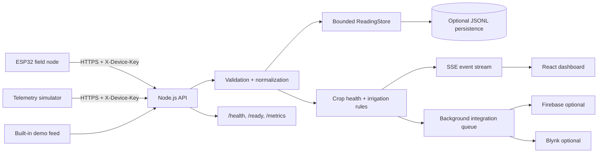

# Fieldline Architecture

## Design goal

Fieldline is an IoT telemetry and decision-support application for crop monitoring. The architecture intentionally stays small: one stateless HTTP service, a bounded telemetry repository, an optional append-only local persistence file, a React dashboard, and optional third-party mirrors. It does **not** introduce Kafka, Redis, Kubernetes, microservices, or ML because the current workload does not justify their operational cost.

## System components

## Request flow

1. A device posts telemetry to `POST /api/v1/readings`.
2. The server applies per-IP rate limiting and optional device-key authentication.
3. The request body is size-limited and must be JSON.
4. Domain validation checks device ID, timestamps, sensor ranges, and GPS ranges.
5. Values are normalized to numeric types and a canonical ISO-8601 timestamp.
6. The reading is appended to the in-memory bounded repository and, when configured, to a JSONL file.
7. Crop-health and irrigation metrics are calculated synchronously because they are deterministic and cheap.
8. The API returns immediately after local acceptance. Firebase/Blynk mirroring happens on a bounded background queue so third-party latency does not block ingestion.
9. A Server-Sent Events message tells connected dashboards that a new reading exists. The dashboard refreshes its aggregated view.

## API design

The public API is versioned under `/api/v1`. Older `/api/...` routes are kept as compatibility aliases for the original project.

Key endpoints:

- `POST /api/v1/readings` — ingest validated telemetry.
- `GET /api/v1/readings` — retrieve bounded history with `deviceId`, `before`, `after`, and `limit` filters.
- `GET /api/v1/dashboard` — current reading, derived metrics, trends, and history.
- `GET /api/v1/devices` — device inventory based on latest readings.
- `GET /api/v1/stream` — one-way SSE live-update channel.
- `GET /health` — liveness only.
- `GET /ready` — readiness plus store/queue state.
- `GET /metrics` — Prometheus-compatible operational metrics.

## Repository and persistence

`ReadingStore` is a repository abstraction with a bounded in-memory working set. If `DATA_FILE` is configured, each accepted reading is appended as one JSON object per line.

Why JSONL instead of adding PostgreSQL immediately:

- The current telemetry workload is small and write-sequential.
- JSONL keeps local and Docker setup dependency-free.
- The repository boundary isolates storage concerns, so replacing it with PostgreSQL does not require changing HTTP or domain logic.

Tradeoff: JSONL is not appropriate for multi-instance deployment, large historical analytics, concurrent writers, or complex queries. The next scale step would be PostgreSQL/TimescaleDB with indexed `(device_id, timestamp)` queries and retention policies.

## Real-time delivery

Server-Sent Events were chosen over WebSockets because telemetry flows one way from server to dashboard. SSE provides automatic browser reconnection, standard HTTP infrastructure compatibility, and less protocol complexity. If future requirements need dashboard-to-device control, bidirectional WebSockets or an MQTT broker would be more appropriate.

## Third-party integration isolation

Firebase and Blynk mirrors are optional. Ingestion does not wait for them. A small bounded in-memory queue handles integration work with retry/backoff. Queue overflow is counted and logged instead of allowing unbounded memory growth.

Tradeoff: jobs can be lost during process termination. If mirroring becomes business-critical, use a durable queue or outbox table.

## Security controls

- Optional `X-Device-Key` authentication for ingestion.
- Constant-time comparison for the configured device key.
- Per-IP fixed-window rate limits.
- Strict JSON content-type and request body size limit.
- Input validation and numeric bounds.
- Origin allowlist for cross-origin browser calls.
- Security headers and Content Security Policy for the production dashboard.
- Secrets are environment variables only; `.env` is ignored.
- No secrets are returned by health, readiness, or metrics endpoints.

For a real fleet, replace the shared device key with per-device credentials, rotation, and revocation.

## Observability

Every request receives an `X-Request-ID`. Structured JSON logs include request ID, method, path, status, and duration. `/metrics` exposes counters/gauges for request volume, ingestion, stored readings, connected streams, and integration queue depth.

The metrics implementation is deliberately dependency-free. A production environment can scrape the endpoint using Prometheus or a compatible collector.

## Failure handling

- Invalid telemetry: `422` with validation errors.
- Missing/wrong device key: `401`.
- Oversized body: `413`.
- Wrong media type: `415`.
- Rate limit exceeded: `429`.
- Firebase/Blynk failure: logged and retried without rejecting already accepted local telemetry.
- Dashboard stream loss: browser reconnects and retains a periodic HTTP refresh as fallback.
- Graceful shutdown: the server stops accepting new connections on SIGTERM/SIGINT.

## Scaling path

The current architecture is suitable for a single small deployment. If traffic becomes materially larger:

1. Move storage to PostgreSQL/TimescaleDB.
2. Use per-device authentication and indexed device/time queries.
3. Replace the in-process integration queue with a durable outbox/queue.
4. Run multiple API replicas behind a load balancer.
5. Move live events to a shared pub/sub layer only when multiple replicas require it.
6. Add retention/downsampling for historical telemetry.

Those components are intentionally *not* included today because they would add operational complexity without a demonstrated requirement.

